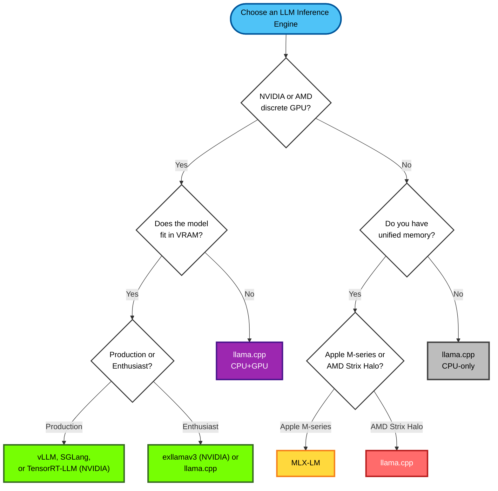

LLM inference has two main stages: prefill (prompt processing), and decode (toekn generation). While LLM training is compute-bound, LLM inference is primarily memory-IO bound, especially in the token generation phase. A high-performance LLM inference engine must be optimized for both workloads: a fast, compute-heavy prefill and a low-latency, memory-bound decode loop.

### Hardware

| Configuration          | Memory      | Cost    | Prefill | Generation |
| ---------------------- | ----------- | ------- | ------- | ---------- |
| 2× NVIDIA RTX 3090     | 48 GB VRAM  | ~$1,500 | Fast    | Fast     |
| 1× NVIDIA RTX 5090     | 32 GB VRAM  | ~$2,000 | Fast    | Fast       |
| 1× NVIDIA RTX Pro 6000 Blackwell Workstation  | 96 GB VRAM  | ~$7,300 | Fast    | Fast       |
| 2× NVIDIA RTX Pro 6000 Blackwell Workstation  | 192 GB VRAM  | ~$14,600 | Fast    | Fast       |
| 4× NVIDIA RTX Pro 6000 Blackwell Max-Q  | 384 GB VRAM  | ~$29,200 | Fast    | Fast       |
| AMD Strix Halo (Ryzen AI Max+ 395) | Up to 128 GB unified memory | ~$2,000 | Medium  | Slow       |
| Apple MacBook Pro / Mac Studio M4 Max | 128 GB unified memory | ~$4,000 | Medium  | Medium     |
| Apple Mac Studio M3 Ultra | 256–512 GB unified memory | ~$8,000+ | Medium  | Medium     |
| AMD EPYC / Threadripper PRO (CPU-only) | 256 GB–2 TB RAM | ~$5,000+ | Slow    | Slow       |
| Desktop CPU (Intel Core / AMD Ryzen) | 32–128 GB RAM | ~$1,000 | Slow    | Slow       |

### Inference engines

LLM inference engines load the weights of a model and allow running inference on the given text or multimodal (images, videos) inputs. They also offer features such as KV prefix caching to speed up subsequent requests in a conversation.

| Name                                                                       | GitHub stars* | Type                                                                               | Scale                                     |
| -------------------------------------------------------------------------- | ------------- | ---------------------------------------------------------------------------------- | ----------------------------------------- |
| [vLLM](https://docs.vllm.ai/)                                              | 63.1k         | Open Source (Apache-2.0)                                                           | High-throughput production                |
| [SGLang](https://docs.sglang.ai/)                                          | 20.2k         | Open Source (Apache-2.0)                                                           | High-throughput production                |
| [TensorRT-LLM](https://nvidia.github.io/TensorRT-LLM/)                     | 12.1k         | Open Source (Apache-2.0)                                                        | High-throughput production                |
| [llama.cpp](https://github.com/ggml-org/llama.cpp)                         | 89.8k         | Open Source (MIT)                                                                  | Enthusiast / local-first                  |
| [exllamav3](https://github.com/turboderp-org/exllamav3)                    | 571           | Open Source (MIT)                                                                  | Enthusiast / local-first                  |
| [MLX (Apple MLX + MLX-LM)](https://ml-explore.github.io/mlx/)              | 22.8k         | Open Source (MIT)                                                                  | Enthusiast / Apple-silicon dev & research |
| [Modular (MAX engine)](https://www.modular.com/max/solutions/ai-inference) | 25.2k         | **Proprietary / source-available** (Apache-2.0 code under a community use license) | High-throughput production                |

#### Understanding the Decision Points

- **Discrete GPU**: A dedicated graphics card with its own Video RAM (VRAM), separate from system RAM. NVIDIA GPUs (like RTX 4090, A100, H100) and AMD GPUs (like RX 7900 XTX, MI300) are discrete GPUs. These offer the highest performance for LLM inference but are limited by their VRAM capacity.

- **Unified Memory**: A memory architecture where the CPU and GPU share the same physical memory pool, eliminating the need for separate VRAM. This allows models larger than traditional GPU VRAM to run efficiently.
  - **Apple M-series**: Apple Silicon chips (M1, M2, M3, M4, M5) with unified memory architecture. Available in configurations from 8GB up to 512GB (M3 Ultra).
  - **AMD Strix Halo**: AMD's APU series (including the Ryzen AI Max+ 395) with integrated RDNA graphics and up to 128GB of unified LPDDR5X memory.

- **Does the model fit in VRAM?**: Can the entire model (including weights, KV cache, and activations) fit in your GPU's VRAM? For example:
  - A 7B parameter model in FP16 requires ~14GB VRAM
  - A 70B parameter model in FP16 requires ~140GB VRAM
  - Quantization (INT8, INT4) can reduce memory requirements by 2-4x

- **Production or Enthusiast?**: 
  - **Production**: You need high throughput, batch processing (processing multiple requests simultaneously to maximize GPU utilization), robust serving features, API endpoints, and proven reliability at scale.
  - **Enthusiast**: You're running models locally, experimenting, or building personal applications where ease of use and flexibility matter more than maximum throughput.

Tensor Parallelism and batch inference
https://medium.com/@himanshushukla.shukla3/stop-using-llama-cpp-for-multi-gpu-setups-use-vllm-or-exllamav2-instead-73992cf1a1ad

Does the full or quantized model that you want to run fully fit in GPU or unified memory? 

### Production level, high-throughput inference engines

These engines are used in production by large companies to serve text and multimodal LLMs at scale. They primarily focus on serving models that fit within the VRAM of the GPUs.

- [vLLM](https://github.com/vllm-project/vllm)
  - Originally developed in the Sky Computing Lab at UC Berkeley

### Enthusiast inference engines

These engines often allow using a combination of 

Where to start

If you are new to the LLM Inference world, I would recommend starting with LMStudio.

