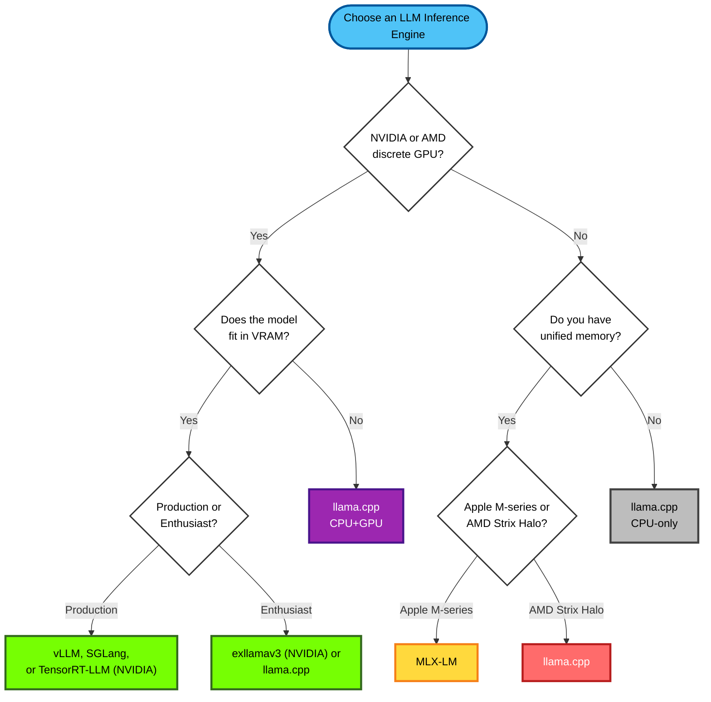

In this post, I'll walk you through the essentials of running large language models locally. We'll cover the hardware options ranging from consumer GPUs to unified memory systems, explore the leading inference engines (vLLM, SGLang, llama.cpp, and more), dive deep into quantization techniques that can make the difference between fitting a model in your VRAM or not, and review the user interfaces available for interacting with your local models.

If you are completely new to this world of LLM inference and just want to get started with running models locally then download [LM Studio](https://lmstudio.ai/), which has backends like llama.cpp and MLX that will run on any hardware.

### Inference engines

LLM inference engines load the weights of a model and allow running inference on the given text or multimodal (images, videos) inputs. They also offer features such as KV prefix caching, which means remembering previous parts of the conversation so the model doesn't have to reprocess them with each new response, speeding up responses.

Inference has two main stages: prefill and decode. Prefill is the prompt processing step which takes the input (question) to the model and processes it, while decode is the token generation phase which generates the output from the model, token by token. While LLM training is compute-bound, LLM inference is primarily memory-IO bound, especially in the token generation phase. A high-performance LLM inference engine must be optimized for both workloads: a fast, compute-heavy prefill and a low-latency, memory-bound decode loop.

Modern inference engines employ several techniques to maximize throughput and enable running larger models. **Batch processing** groups multiple requests together to better utilize GPU compute during both prefill and decode phases. **Tensor parallelism** splits model layers across multiple GPUs, allowing models that don't fit on a single GPU to run efficiently—though this requires high-bandwidth interconnects like NVLink to avoid bottlenecks. **Pipeline parallelism** assigns different layers to different GPUs, processing requests sequentially through the pipeline. Production engines like vLLM and SGLang also implement **continuous batching** (dynamically adding/removing requests from batches) and **PagedAttention** (efficient KV cache memory management) to maximize GPU utilization and throughput.

| Name                                                                       | GitHub stars | Type                                                                               | Scale                                     |
| -------------------------------------------------------------------------- | ------------- | ---------------------------------------------------------------------------------- | ----------------------------------------- |
| [vLLM](https://docs.vllm.ai/)                                              | 63.1k         | Open Source (Apache-2.0)                                                           | High-throughput production                |
| [SGLang](https://docs.sglang.ai/)                                          | 20.2k         | Open Source (Apache-2.0)                                                           | High-throughput production                |
| [TensorRT-LLM](https://nvidia.github.io/TensorRT-LLM/)                     | 12.1k         | Open Source (Apache-2.0)                                                        | High-throughput production                |
| [llama.cpp](https://github.com/ggml-org/llama.cpp)                         | 89.8k         | Open Source (MIT)                                                                  | Enthusiast / local-first                  |
| [exllamav3](https://github.com/turboderp-org/exllamav3)                    | 571           | Open Source (MIT)                                                                  | Enthusiast / local-first                  |
| [MLX (Apple MLX + MLX-LM)](https://github.com/ml-explore/mlx-lm)              | 22.8k         | Open Source (MIT)                                                                  | Enthusiast / Apple-silicon dev & research |
| [Ollama](https://ollama.com/)                                              | 156k          | Open Source (MIT)                                                                  | Enthusiast / local-first                  |

> **Note:** While Ollama initially used llama.cpp as its backend, it now has [its own inference engine](https://ollama.com/blog/multimodal-models), particularly for supporting multimodal models with improved reliability, accuracy, and model modularity.

The following decision tree will help you select the most appropriate inference engine based on your hardware configuration and use case:

#### Understanding the Decision Points

- **Discrete GPU**: A dedicated graphics card with its own Video RAM (VRAM), separate from system RAM. NVIDIA GPUs (like RTX 4090, A100, H100) and AMD GPUs (like RX 7900 XTX, MI300) are discrete GPUs. These offer the highest performance for LLM inference but are limited by their VRAM capacity.

- **Unified Memory**: A memory architecture where the CPU and GPU share the same physical memory pool, eliminating the need for separate VRAM. This allows models larger than traditional GPU VRAM to run efficiently.
  - **Apple M-series**: Apple Silicon chips (M1, M2, M3, M4, M5) with unified memory architecture. Available in configurations from 8GB up to 512GB (M3 Ultra).
  - **AMD Strix Halo**: AMD's APU series (including the Ryzen AI Max+ 395) with integrated RDNA graphics and up to 128GB of unified LPDDR5X memory.

- **Does the model fit in VRAM?**: Can the entire model (including weights, KV cache, and activations) fit in your GPU's VRAM? For example:
  - A 7B parameter model in FP16 requires ~14GB of VRAM
  - A 70B parameter model in FP16 requires ~140GB of VRAM
  - Quantization (INT8, INT4) can reduce memory requirements by 2-4x

- **Production or Enthusiast?**: 
  - **Production**: You need high throughput, batch processing (processing multiple requests simultaneously to maximize GPU utilization), robust serving features, API endpoints, and proven reliability at scale.
  - **Enthusiast**: You're running models locally, experimenting, or building personal applications where ease of use and flexibility matter more than maximum throughput.

### Hardware

The hardware you choose determines which models you can run and how fast they'll perform. The table below compares various configurations, from budget-friendly consumer GPUs to high-end workstation setups. The "Model Size" column shows the approximate parameter range you can run with quantization (more on that below), while "Prefill" and "Generation" indicate the speed of prompt processing and token generation respectively.

> **Note:** The model size ranges assume 4-bit to 8-bit quantization. Without quantization (FP16), memory requirements roughly double.

| Configuration          | Memory      | Model Size | Prefill | Generation | Cost    |
| ---------------------- | ----------- | ----------------------- | ------- | ---------- | ------- |
| 2× NVIDIA RTX 3090     | 48 GB VRAM  | 41B - 72B | Fast    | Fast     | ~$1,500 |
| 1× NVIDIA RTX 5090     | 32 GB VRAM  | 27B - 48B | Fast    | Fast       | ~$2,000 |
| 1× NVIDIA RTX Pro 6000 Workstation (600W)  | 96 GB VRAM  | 82B - 144B | Fast    | Fast       | ~$7,300 |
| 2× NVIDIA RTX Pro 6000 Workstation (600W)  | 192 GB VRAM  | 164B - 288B | Fast    | Fast       | ~$14,600 |
| 4× NVIDIA RTX Pro 6000 Max-Q (300W)  | 384 GB VRAM  | 329B - 576B | Fast    | Fast       | ~$29,200 |
| AMD Strix Halo (Ryzen AI Max+ 395) | 128 GB unified | 106B - 186B | Medium  | Slow       | ~$2,000 |
| Apple MacBook Pro / Mac Studio M4 Max | 128 GB unified | 91B - 160B | Medium  | Medium     | ~$4,000 |
| Apple Mac Studio M3 Ultra | 256–512 GB unified | 182B - 640B | Medium  | Medium     | ~$8,000+ |
| AMD EPYC / Threadripper PRO (CPU-only) | 256 GB–2 TB RAM | 219B - 3.0T | Slow    | Slow       | ~$5,000+ |
| Desktop CPU (Intel Core / AMD Ryzen) | 32–128 GB RAM | 27B - 192B | Slow    | Slow       | ~$1,000 |

### Quantization

Quantization often makes the difference between being able to run an LLM model locally or not. Quantization is taking the weights of a model and reducing their precision (bit-width), basically compressing them. For example, converting from FP16 (16-bit floating point) to INT8 (8-bit integer) or INT4 (4-bit integer) can reduce memory requirements by 2x or 4x respectively, with minimal impact on model quality. This allows running larger models on hardware with limited VRAM or unified memory.

Common quantization formats include:
- **FP16/BF16**: 16-bit floating point, baseline for most models
- **INT8**: 8-bit integer quantization, ~2x compression
- **4-bit quantization** (~4x compression):
  - **INT4**: Simple 4-bit integer quantization
  - **NVFP4/MXFP4**: 4-bit floating point formats (NVIDIA FP4 and Microscaling FP4), offering better accuracy than INT4
  - **AWQ**: Activation-aware Weight Quantization, optimizes which weights to quantize based on activation patterns
  - **GPTQ**: Layer-wise quantization method that preserves model quality
- **GGUF, exl3**: Advanced quantization formats with flexible bit-width support

Among these formats, GGUF deserves special attention due to its popularity and unique capabilities. **GGUF (GPT-Generated Unified Format)** is a file format designed for the widely popular [llama.cpp](https://github.com/ggml-org/llama.cpp) project that enables CPU/GPU hybrid inference. Its key advantage is the ability to offload a specified number of model layers to GPU VRAM while keeping the rest in system RAM, making it possible to run models larger than available VRAM (though with reduced speed).

GGUF offers two categories of quantization:
- **Legacy Quants** (Q4_0, Q5_1, Q8_0): Older, simpler methods using a single scale and zero-point per block. Generally not recommended except for Q8_0, which provides near-lossless 8-bit quality.
- **K-Quants** (Q4_K_M, Q5_K_S, Q6_K): The modern standard using advanced grouped and mixed-precision formats with smaller block sizes and higher-precision scaling factors. The suffixes indicate the bit-depth mix:
  - **S (Small)**: Lower quality, smaller size
  - **M (Medium)**: Balanced approach, using higher bit-depths for critical layers
  - **L (Large)**: Higher quality, larger size

**Recommended GGUF quantization levels:**
- **Q8_0**: Near-FP16 quality, use when memory is not constrained
- **Q6_K**: Excellent high-quality option, also close to FP-16 quality.
- **Q5_K_M**: The "sweet spot" balancing accuracy and size
- **Q4_K_M**: The "safe default" for most VRAM-constrained setups
- **Q2_K/Q3_K**: Extreme compression with noticeable quality loss

Note that GGUF prioritizes flexibility over raw speed—it's typically slower than GPU-native formats like EXL2 in both token generation and prompt processing.

The graph below shows the impact of quantization on LLM quality. As the number of bits used for quantization increases from 2 to 16, perplexity decreases (lower is better). Perplexity is an evaluation metric that measures how well a language model predicts the next word in a sequence: a lower perplexity score indicates better, more confident predictions. The metric scales smoothly with model size across quantization levels, with 6-bit quantization staying within 0.1% of FP16. The [table](https://github.com/ggml-org/llama.cpp/pull/1684) on this list explains in more detail the 10 quantization data points chosen for each model size.

For flexible GPU-only quantization, I'd like to give a special shout-out to [exllamav3](https://github.com/turboderp-org/exllamav3) and its **EXL3** format. Based on Cornell's QTIP quantization method, EXL3 allows you to specify a target bitrate (bits per weight) when converting models, making it possible to quantize a model to fit precisely within your available VRAM. Unlike fixed quantization levels (e.g., Q4, Q6, Q8), you can choose any bitrate—say 3.2 bpw or 4.75 bpw—to maximize model size while staying within your hardware constraints. The conversion process is also remarkably efficient, taking just minutes for smaller models and a few hours for 70B+ models on a single GPU, compared to hundreds of GPU-hours required by some other SOTA quantization methods.

Here's an EXL3-specific example of the relationship between quantization bits and perplexity:

### Interfaces

Once you've chosen your hardware and inference engine, you'll need a user interface to interact with your models. LLM interfaces range from feature-rich desktop applications with bundled inference engines to lightweight web clients that connect to external APIs. Some applications like LM Studio and Jan bundle their own inference engines for a plug-and-play experience, while others like Open WebUI and LibreChat act as universal frontends that connect to any OpenAI-compatible API endpoint. Many interfaces expose OpenAI-compatible APIs themselves, making it easy to integrate local models into existing applications. The table below compares popular options based on their architecture, integration capabilities, and community adoption.

| Name | GitHub Stars | Type & Engine | Integrations |
| :--- | :--- | :--- | :--- |
| [**LM Studio**](https://lmstudio.ai/) | N/A | Bundled `llama.cpp`-based engine (proprietary) | Exposes OpenAI-compatible API |
| [**llama.cpp WebUI**](https://github.com/ggml-org/llama.cpp/discussions/16938) | **89.9k** | Client-only | Connects to `llama-server` via OpenAI API |
| [**Jan**](https://jan.ai/) | **39.3k** | Bundled `llama.cpp` engine | Exposes OpenAI API; connects to OpenAI, Claude, Gemini |
| [**text-generation-webui**](https://github.com/oobabooga/text-generation-webui) | **45.4k** | Multi-engine loader (Transformers, llama.cpp, ExLlama, TRT-LLM) | Exposes OpenAI-compatible API |
| [**Open WebUI**](https://github.com/open-webui/open-webui) | **115k** | Client-only | Connects to Ollama, LM Studio, Groq, any OpenAI API |
| [**LibreChat**](https://github.com/danny-avila/LibreChat) | **31.7k** | Client-only | Connects to OpenAI, Azure, Google, Anthropic, Ollama, etc. |
| [**GPT4All Desktop**](https://www.nomic.ai/gpt4all) | **76.9k** | Bundled `llama.cpp`-derived + Nomic engine | Internal API with SDK access |
| [**AnythingLLM**](https://github.com/Mintplex-Labs/anything-llm) | **51.1k** | RAG-focused client | Connects to Ollama, LM Studio, OpenAI, Azure, Anthropic |
| [**Chatbox**](https://chatboxai.app/) | **37.4k** | Client-only | Connects to OpenAI, Claude, Gemini, local/Ollama |

> **Note:** Star counts are dynamic and change daily. These figures were accurate as of mid-November 2025. "LM Studio" is listed as N/A as its primary UI application is proprietary and not a public GitHub repository. The star count for "llama.cpp WebUI" refers to the main `llama.cpp` repository, as the WebUI is a feature of its bundled server.

Here are a few screenshots, starting with LM Studio:

 

llama.cpp WebUI

 

Jan

 

text-generation-webui

 

OpenWebUI

