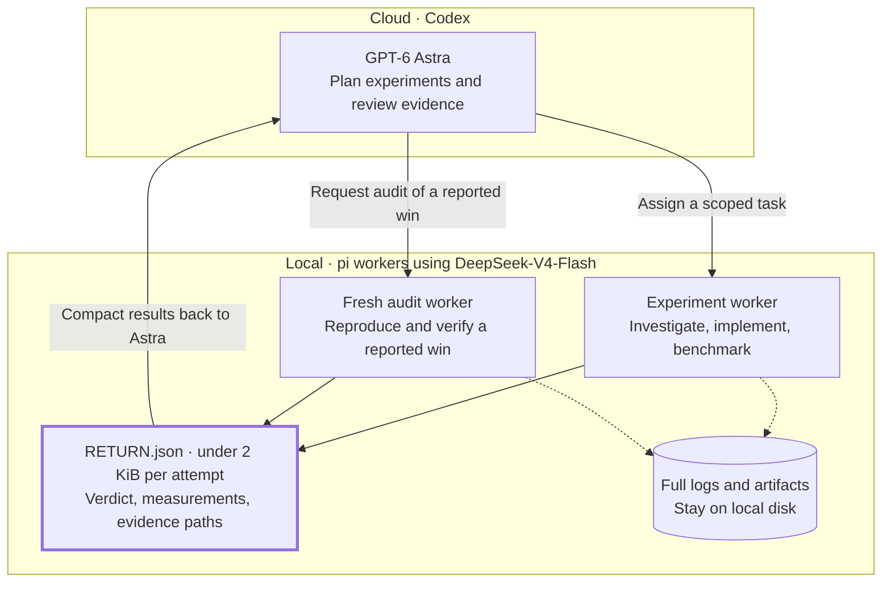

**I saved $1,417 in one week of AI-driven CUDA kernel research by letting GPT-6 Astra think and a cheaper local DeepSeek-V4-Flash do the grunt work.** GPT-6 Astra acted as the research scientist and orchestrator, designing experiments and judging evidence, while local [pi](https://pi.dev/) subagents running DeepSeek-V4-Flash on my own GPUs did that work: source investigation, kernel implementation, debugging, measurement. The research target was the vLLM server on my dual RTX Pro 6000 Blackwell box that serves DeepSeek-V4-Flash itself, so the local model spent the week, in a sense, working to make itself faster. The local side processed **798M tokens** across 10,684 model calls, work that would have cost **$1,416.57** at Astra's metered rates, nearly 3.0x the orchestrator's own usage, and kept **74.9%** of the run's total token cost off the cloud.

I pay $100/month for OpenAI Pro, and Astra alone hit my weekly limit during this experiment. Its usage would have cost **$475.97 at metered API rates**. The $1,417 above is what the local work would have cost at those same rates, so it measures how much extra work I could get done with the GPUs I already own. I still had to pay for electricity, but I could keep the workers running without buying more cloud usage.

## The setup

I run Astra in the Codex harness, where it keeps track of the research plan and previous measurements. It uses those results to decide what to try next, then writes a small task for a fresh pi worker connected to my local vLLM server.

Each worker investigates source code, implements a change, or runs benchmarks, depending on the assignment. It sends back a short result file while keeping its full logs locally. When a worker reports a speedup, Astra assigns a separate audit worker to reproduce it before accepting the result.

Both worker roles use the same local vLLM endpoint on my dual RTX Pro 6000 Blackwell machine. Solid arrows show task assignments and returned results; dotted arrows show logs and artifacts saved locally. Astra receives the compact return files and assigns audits when a result needs independent verification.

## The numbers

I took the token counts directly from each harness's logs. For the dollar comparison, I priced both columns at Astra's short-tier rates: $10 per million fresh input tokens, $1 per million cached input tokens, and $50 per million output tokens. All of Astra's usage stayed in that tier. These are equivalent costs; my actual cloud bill was the flat subscription.

| | Astra (cloud) | pi (local) |
|---|---:|---:|
| sessions / runs | 50 | 202 |
| model calls | 3,409 | 10,684 |
| fresh input tokens | 7,930,476 | 15,675,857 |
| cached input tokens | 313,229,952 | 773,482,240 |
| output tokens | 1,668,664 | 9,190,551 |
| total tokens | 322,829,092 | 798,348,648 |
| cost / imputed cost | **$475.97** | **$1,416.57** |

The local workers generated 5.5x as many output tokens as Astra: 9.19M against 1.67M. At $50 per million, that output alone would cost $459.53, almost as much as all of Astra's usage. Having the local model write and debug the kernels accounted for a substantial part of the savings.

Astra's cost came mostly from input. Across 3,409 calls, its average prompt was 94K tokens, with a 97.5% cache hit rate. Even with that cache hit rate, **cached input accounted for $313.23, or 65.8% of its equivalent cost**. Output accounted for $83.43. Keeping unnecessary text out of those repeated prompts mattered quite a bit.

## Keeping worker logs out of Astra's context

Each worker attempt must end with a `RETURN.json` under 2 KiB. If the file exceeds that limit, the result is rejected as unverified. The worker's full transcript stays local and is never replayed into Astra's context.

Over the week, the workers accumulated **29.0 GB** of transcripts. Their return files sent less than 576 KB back to Astra, roughly **50,000 times less data**.

Text that enters Astra's context contributes to input usage again on later calls for as long as it remains there, even when it is cached. Passing along the workers' tool output would have filled the 258K context window quickly and required more compaction. The small return files let Astra review results without carrying all the intermediate debugging output through the rest of the session.

Simply pricing every token at Astra's rates gives a combined cost of $1,892.53. That comparison does not account for how the orchestrator's context would have changed if it had done the work itself or received the full worker transcripts.

## What the research itself found

We found a kernel optimization that ran about **10% faster** in isolated benchmarks. A separate worker reproduced the speedup and verified bit-for-bit identical output. In the full vLLM server, though, we could not measure any improvement: the operation accounted for only around 0.03% of total request time.

After a week of work, I still had no measurable server speedup. I did have a tested optimization and enough measurements to stop spending time on that particular operation. I'll cover the kernel changes and the server measurements in a separate post.

## What the cost comparison leaves out

The $1,416.57 estimate assumes Astra would use exactly as many tokens as the local model. It is a stronger model and might finish the same tasks with fewer tokens and retries. I also let the local workers retry more freely than I would have on a metered budget. There were 93 worker runs that logged no usage at all, alongside the runs counted in the table. Between those differences and the context costs described above, I cannot say exactly what an Astra-only run would have cost.

The figures exclude electricity and GPU depreciation, as well as the time workers spent waiting for the GPU lock. I also spent time building and fixing the delegation harness; several experiment rounds went into getting that working before they could contribute to the kernel research.

For my setup, the extra research capacity was worth that effort. Astra used up my weekly allowance just planning experiments and reviewing the results, while the local workers handled hundreds of millions of tokens of implementation and debugging. With the hardware already here, that gave me room to run experiments I could not fit into the subscription alone.

## References

- [Pi coding agent](https://pi.dev/) and [pi-subagents](https://github.com/nicobailon/pi-subagents)
- [Pi with local open-weights models](https://www.ovidiudan.com/2026-04-26/pi-local-open-weights.html), my earlier setup post
- [Dual RTX Pro 6000 LLM guide](https://www.ovidiudan.com/2025-12-25/dual-rtx-pro-6000-llm-guide.html), the machine the local workers ran on
