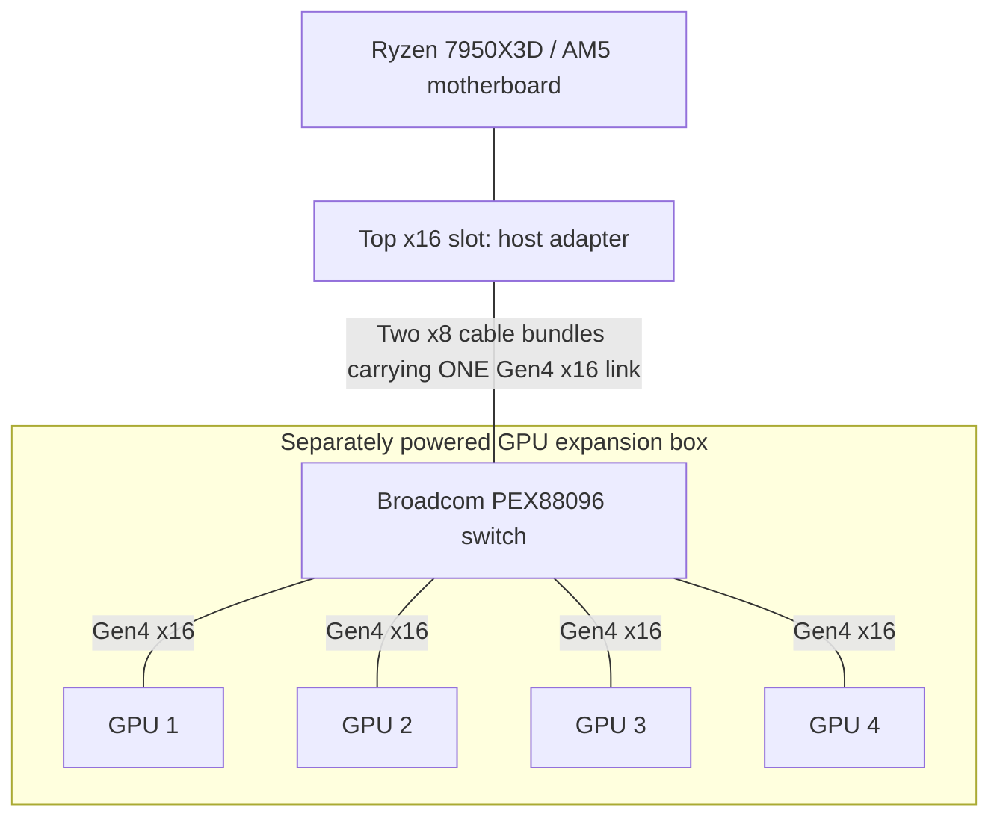

I have a dream. Of running four or more GPUs off of a regular consumer motherboard that technically cannot do that. At least, not with the connections I want. To make this happen, I had to research some pretty esoteric hardware. Come with me on a journey which brought me to the world of PCIe switches.

I currently own a pretty beefy consumer machine (bought at pre-insane prices) with an AM5 socket motherboard. The problem is that my Ryzen has 28 native PCIe lanes, four of which connect to the chipset. Of the remaining lanes, only 16 are routed to the motherboard's two graphics slots. That means I can connect a single GPU at PCIe 5.0 x16, or two GPUs at x8 each, which is what I'm doing now. Each GPU therefore already has the same theoretical PCIe bandwidth as a Gen4 x16 connection.

To connect four GPUs, I could split the lanes further and give less bandwidth to each GPU. Or I could install a PCIe switch. That would let the GPUs talk to each other over P2P at the speed of their connections to the switch, while sharing a smaller pipe back to the machine, like 16 lanes. For the inference setup I want, where the model stays in GPU memory, that should be fine. The host connection would be used mainly to load the model, send in the prompts, and read the responses. The repeated GPU-to-GPU transfers could stay on the switch instead of competing for that connection.

My plan is to put four RTX Pro 6000s in a separate box with a Broadcom PEX88096 backplane, its own power supply, and enough room to cool the cards. Two PCIe cables would connect it to the existing PC. This particular switch is Gen4, so that's the speed the cards would run at, even though they support Gen5. The Gen5 alternatives cost several times as much, and I'd rather find out how well the cheaper setup runs my models before spending that money.

This reference photo is close to what I have in mind:


## Why I want to keep the AM5 board

Here is my current hardware:

```text
CPU: AMD Ryzen 9 7950X3D 16-Core
Motherboard: ROG CROSSHAIR X670E HERO
RAM: 192 GB DDR5 5200
GPU: Dual NVIDIA RTX Pro 6000 (96 GB VRAM each)
```

This is the machine from my [dual-GPU vLLM guide](https://www.ovidiudan.com/2025/12/25/dual-rtx-pro-6000-llm-guide.html). I don't particularly want to replace the CPU, motherboard, and RAM just to connect more GPUs. Prices have gone completely insane: for example a comparable Corsair 192 GB DDR5-5200 kit that was [$649.99 before the shortage](https://www.tomshardware.com/pc-components/ram/ram-scalping-takes-hold-on-ebay-some-kits-selling-for-more-than-usd2-000-price-gouged-kits-fetch-7x-their-original-value-adding-almost-double-the-markup-on-already-inflated-prices) is now [listed at $2,904.99](https://www.corsair.com/us/en/p/memory/cmk192gx5m4b5200c38/vengeance-192gb-4x48gb-ddr5-dram-5200mhz-c38-memory-kit-black-cmk192gx5m4b5200c38), more than four times as much for the same RAM.

And yes, consumer machines can run four GPUs through narrower links and adapters. Mining rigs have been doing that for years. I'm after four x16 connections for inference, with the GPUs able to exchange data without going back through the motherboard.

## Bifurcation doesn't add lanes

A passive bifurcation adapter splits an existing link. If the motherboard supports x4/x4/x4/x4, it can divide an x16 slot between four devices. Each gets four lanes. An x16-shaped socket on the adapter doesn't change that.

A PCIe switch works differently. It has an upstream link to the host and separate downstream links to the devices. The PEX88096 has enough lanes for an x16 upstream connection and four x16 GPU connections, with lanes left over. When a GPU accesses system memory, the switch forwards that traffic upstream. When one GPU accesses another GPU's memory through a supported P2P path, the switch can route it locally.

That last part is why I'm interested. The GPUs don't have to send their peer traffic up the cable to the motherboard and back again.

Here is the topology I want:



For example, GPU 1 to GPU 2 traffic follows GPU 1 → switch → GPU 2. There is no separate cable connecting the GPUs to each other, as NVIDIA decided to nerf even these Workstation-class clards and omit the typical NVLink that would allow connecting them to each other directly.

## The PEX88096 backplane

This is the type of board I'm planning around:


_Photo from [vitabis's build](https://forum.level1techs.com/t/poor-er-mans-local-ai/252071/3). The four GPUs plug directly into these slots; the large heatsink cools the switch._

The PEX88096 is a PCIe Gen4 switch, often called a PLX switch in listings and forum posts. The usual description is a 96-lane switch. [Broadcom's specification](https://www.broadcom.com/products/pcie-switches-retimers/expressfabric/gen4/pex88096) lists 98 including two dedicated x1 management ports. The useful arithmetic for this build is 16 host lanes + 64 GPU lanes = 80 lanes.

There is useful background from [OLDMONSTER, the author of the open-source PEX8796/PEX88096 designs](https://forums.servethehome.com/index.php?threads/about-chinese-pcie-switch.55718/). He describes a Chinese market for salvaged and refurbished switch chips, with a PEX88096 chip costing around $60 and an AIC version costing around $110 to make locally. Those are his reported costs, not a price I can order this backplane for, shipped to the US. My kit, including the backplane, host adapter, and cables, cost closer to $600 before shipping and taxes. I'll get to the full order total below.

## Connecting it to a regular PCIe slot

My X670E Hero doesn't have MCIO or SlimSAS ports. The host adapter supplies those connectors by plugging into the top PCIe slot:


This is the kit I ordered. The card on the left plugs into the motherboard, and the two cables connect it to the backplane on the right. Each cable carries eight PCIe lanes. The GPUs plug directly into the backplane, so I don't need a separate cabled slot adapter for each one.

Two cables don't imply x8/x8 bifurcation. In this arrangement they carry the two halves of one x16 link to one switch. The adapter must support that wiring, including the required clock and reset signals. I need a matched adapter/cable/backplane combination, not just connectors that fit.

I'll also leave the second CPU-connected slot empty so the host adapter can get all 16 lanes, using the Ryzen's integrated graphics for display output.

A redriver or retimer may be needed if the signal path is too lossy. They aren't switches and don't add device ports. I don't plan to add one automatically: in [the initial switch-board test](https://forums.servethehome.com/index.php?threads/new-chinese-pcie-switch-board-gpu-testing.52488/post-485898), a retimer interfered with automatic power-on timing, and changing to a passive adapter helped. In a [different Gen5 build](https://forum.level1techs.com/t/171428/924), a retimer was needed to stop GPUs dropping out. Those are different systems with different signal paths.

The AM5 example closest to my plan is [vitabis's build](https://forum.level1techs.com/t/poor-er-mans-local-ai/252071/3): a Ryzen 9600X, Gigabyte X670E Aorus Master, and four 3090s on the switch backplane.


_Vitabis's assembled build. The stacked frames leave more space between the cards than a normal motherboard would._

## Why Gen4 when the cards support Gen5?

The PEX88096 limits my Gen5-capable GPUs to Gen4, but that sounds worse than it is for my particular machine. My two cards already run at Gen5 x8 each. Gen5 x8 and Gen4 x16 both provide about 31.5 GB/s in each direction before packet overhead. So I'm not halving each GPU's link bandwidth compared with what I have now. I'm trying to give four GPUs the same per-link bandwidth my two GPUs already have.

The shared connection to the CPU is a different story. Today I have two Gen5 x8 links, with about 63 GB/s of combined theoretical bandwidth in each direction. The backplane will share one Gen4 x16 uplink, about 31.5 GB/s, among all four GPUs. Model loading and any CPU offloading will share that smaller pipe. With working switch-local P2P, GPU-to-GPU transfers don't need to use it.

As for actual inference speed, the closest large-model comparison I found is [StorageReview's HP Z8 Fury G6i review](https://www.storagereview.com/review/hp-z8-fury-g6i-review-one-xeon-up-to-four-blackwell-gpus). They tested the same pair of RTX Pro 6000 Blackwell Max-Q cards in two workstations: the HP gave both GPUs Gen5 x16, while the Dell ran one at Gen5 x16 and the other at Gen4 x16. For GPT-OSS-120B at 256 concurrent requests, the HP was about 3% ahead on their decode-heavy workload and 7% ahead on their prefill-heavy workload. Those are aggregate total-token-throughput results, not the speed of a single chat. The CPU and memory configuration also changed, so this doesn't isolate the benefit of Gen5.

[Puget Systems also tested PCIe generations and lane widths directly](https://www.pugetsystems.com/labs/articles/impact-of-pcie-5-0-bandwidth-on-gpu-content-creation-performance/) and found no consistent inference-performance trend in its small, single-GPU llama.cpp test. That is reassuring for models that fit on one card, but it doesn't tell me what happens with a large model split across four GPUs. And [thr3e reports saturating Gen5 x16 during vLLM tensor-parallel prefill](https://forum.level1techs.com/t/pcie4-vs-pcie5-for-2xb70-on-llm-scaler-looking-for-advice-pcie5-rig-is-also-my-gaming-rig/248578/3), while bandwidth wasn't a measurable concern during decode on that setup. I can't turn those results into a universal percentage. I'll need to measure prompt processing and token generation separately on my own build.

If I did go Gen5, the [PEX89048](https://www.broadcom.com/products/pcie-switches-retimers/expressfabric/gen5/pex89048) is a 48-lane switch. With 16 lanes used upstream, there are 32 left: enough for two x16 GPU links, or four x8 links if the board supports that configuration. Those four Gen5 x8 links would have the same per-link bandwidth as the four Gen4 x16 links I'm planning around. It isn't a four-x16 replacement for the PEX88096.

The [PEX89104](https://www.broadcom.com/products/pcie-switches-retimers/expressfabric/gen5/pex89104) has 104 Gen5 lanes and enough capacity for my proposed topology. There are larger boards too: [ServeTheHome post #81](https://forums.servethehome.com/index.php?threads/new-chinese-pcie-switch-board-gpu-testing.52488/post-501529) shows a UTran PEX89144 board with eight downstream x16 slots and a dual-MCIO upstream connection. That post describes the hardware received, not a completed eight-GPU performance test.


_UTran's eight-slot board from the ServeTheHome post. The Broadcom chip is exposed in this photo; it would need cooling in use._

The complication is getting a good board at a price that makes sense. The [c-payne 100-lane Gen5 switch](https://c-payne.com/products/pcie-gen5-mcio-switch-100-lane-microchip-switchtec-pm50100) below is listed at €2,000, and was sold out when I checked. That buys the switch board, not a complete GPU expansion kit. It uses a Microchip Switchtec PM50100 rather than a Broadcom chip, with MCIO connectors around the edges instead of physical GPU slots. I would still need the host adapter, GPU slot adapters, and cables, plus shipping and any applicable taxes and import charges.


_Product photo: [c-payne](https://c-payne.com/products/pcie-gen5-mcio-switch-100-lane-microchip-switchtec-pm50100). Notice that there are no slots to plug GPUs directly into._

For another price reference, [One Stop Systems lists a five-slot Gen5 x16 backplane at $4,095](https://onestopsystems.com/products/expansion-backplane-5-pcie-x16-5-0-slots-580). The bare backplane alone is about seven times the price of my $577.50 Gen4 kit. Add the rest of the hardware and delivery costs and a Gen5 expansion setup can run past $5,000. Gen5 doubles the link bandwidth, but it doesn't automatically double inference speed. I'll need benchmarks to know how much it would help my models. For this first build, the cheaper kit was a no-brainer.

## What I ordered

I ordered the PEX88096 kit and the case made specifically for it, the one in the first photo. The backplane mounts flat inside, with the GPU brackets along the rear panel, space for a PSU on the left, and a row of fans at the other end. I'd rather start with a case made for this board than find out the mounting holes don't line up after everything arrives.

The expansion cards and cables cost $577.50. The case was another $250, without the PSU or fans. After tax, import taxes, and shipping, the order total came to $976.20. That doesn't include the GPUs, PSU, or fans; those still need to be accounted for in the finished build.

Now we wait. I'll write another post when it arrives and I can test it on my AM5 machine.

## References

- [PLX/PEX PCIe 4.0 seems to help for LLMs and P2P! — Reddit](https://www.reddit.com/r/LocalLLaMA/s/NJNOd4UMfc): Discussion of PEX88096 and other PCIe switches for LLM inference and peer-to-peer transfers, including a comparison with bifurcation.
- [7 GPUs at x16 (5.0 and 4.0) on AM5 with Gen5/4 switches and the P2P driver — Reddit](https://www.reddit.com/r/LocalLLaMA/s/qdBemuDCXd): A seven-GPU AM5 build using Gen5 and Gen4 switches, with reported inference and training results. Another example of expanding a consumer platform beyond its onboard GPU slots.
- [Poor(er) man's local AI — Level1Techs](https://forum.level1techs.com/t/poor-er-mans-local-ai/252071): Vitabis's AM4 and AM5 experiments, including a four-3090 PEX88096 build, adapter and cable choices, mounting photos, and vLLM benchmarks. The closest build to what I'm trying to do.
- [A Neverending Story: PCIe adapters, switches, cables, backplanes, and risers — post #1019](https://forum.level1techs.com/t/171428/1019): Vitabis's follow-up on AM5 P2P, PCIe error reporting, ASPM, and expanding the backplane setup to six GPUs.
- [A Neverending Story: the first PEX88096 experiments — post #837](https://forum.level1techs.com/t/171428/837): Thr3e's original purchase report and board photos. [Post #843](https://forum.level1techs.com/t/171428/843) shows the initial test setup, and [post #846](https://forum.level1techs.com/t/171428/846) reports getting four 3090s running, including the retimer/power-on issue.
- [A Neverending Story: DIP-switch-equipped PCIe switches — post #902](https://forum.level1techs.com/t/171428/902): PEX88096 and PEX88048 board variants with switches for selecting downstream lane configurations, rather than relying only on firmware changes.
- [A Neverending Story: mixed Gen5 and Gen4 GPU setup — post #924](https://forum.level1techs.com/t/171428/924): Discussion around a cascaded PM50100/PEX88096 build, with topology and P2P results in the following posts. Useful for seeing why a connected GPU isn't necessarily a working P2P peer.
- [New Chinese PCIe Switch Board GPU Testing — ServeTheHome](https://forums.servethehome.com/index.php?threads/new-chinese-pcie-switch-board-gpu-testing.52488/): Hands-on PEX88096 testing, board power consumption, GPU enumeration, and CUDA peer-bandwidth and latency results.
- [New Chinese PCIe Switch Board GPU Testing — page 5](https://forums.servethehome.com/index.php?threads/new-chinese-pcie-switch-board-gpu-testing.52488/page-5): The UTran PEX89144 eight-slot Gen5 board pictured above, followed by troubleshooting reports about cables, firmware, and missing downstream devices.
- [About Chinese PCIe Switch — ServeTheHome](https://forums.servethehome.com/index.php?threads/about-chinese-pcie-switch.55718/): OLDMONSTER, the designer of the open-source PEX8796/PEX88096 boards, explains local chip and manufacturing costs, refurbished parts, and the difficulties of making an inexpensive Gen5 board.
- [Broadcom PEX89048](https://www.broadcom.com/products/pcie-switches-retimers/expressfabric/gen5/pex89048) and [PEX89104](https://www.broadcom.com/products/pcie-switches-retimers/expressfabric/gen5/pex89104): Manufacturer specifications for the 48-lane and 104-lane Gen5 alternatives. Useful for checking lane counts instead of relying on marketplace descriptions.
- [c-payne PCIe Gen5 MCIO Switch, 100-lane PM50100](https://c-payne.com/products/pcie-gen5-mcio-switch-100-lane-microchip-switchtec-pm50100): The Microchip-based Gen5 switch pictured above, with its port configuration, price, and manual.
- [AliExpress PCIe switch add-in card listing](https://www.aliexpress.us/item/3256811978810464.html): Another card I looked at while researching. Its photo shows an add-in card with an `89048` Gen5 PCB marking, not the four-slot PEX88096 kit I ordered..
- [LINKUP AVA5 PCIe 5.0 riser cables](https://linkup.one/pcie-5.0-riser-cable-RTX5090): Manufacturer catalog showing cable lengths and connector orientations. The [straight 30 cm version on Amazon](https://www.amazon.com/dp/B0D5F72XTL) was another option I considered if the GPUs needed to be moved away from the backplane slots.
- [RTX Pro 6000 riser cable recommendations — Reddit](https://www.reddit.com/r/BlackwellPerformance/comments/1rcml52/rtx_pro_6000_riser_cable_recommendations/): A discussion of riser choices for these cards. A research lead, not a compatibility guarantee for my particular board and case.
- [Nathan Odle's four-RTX-Pro-6000 build](https://x.com/mov_axbx/status/1999689233171394955): Photos and notes on using native MCIO connections to make a multi-GPU build cleaner than a conventional riser-cable setup.
- [Max Blackwell — Veratu](https://veratu.com/builds/maxblackwell/index.html): A compact multi-GPU workstation build with photos of the cooling and ducting. Useful for thinking about card spacing, flow-through coolers, and power limits.
- [HP Z8 Fury G6i Review: One Xeon, up to Four Blackwell GPUs — StorageReview](https://www.storagereview.com/review/hp-z8-fury-g6i-review-one-xeon-up-to-four-blackwell-gpus): Dual-RTX-Pro-6000 vLLM results comparing full Gen5 GPU links with a mixed Gen5/Gen4 system. Includes GPT-OSS-120B, but the host platforms differ too, so it isn't a PCIe-only comparison.
- [Impact of PCIe 5.0 Bandwidth on GPU Content Creation Performance — Puget Systems](https://www.pugetsystems.com/labs/articles/impact-of-pcie-5-0-bandwidth-on-gpu-content-creation-performance/): Direct tests of PCIe generations and lane widths, including a small single-GPU llama.cpp workload. Useful context, but not a benchmark of a large model spread across four GPUs.
