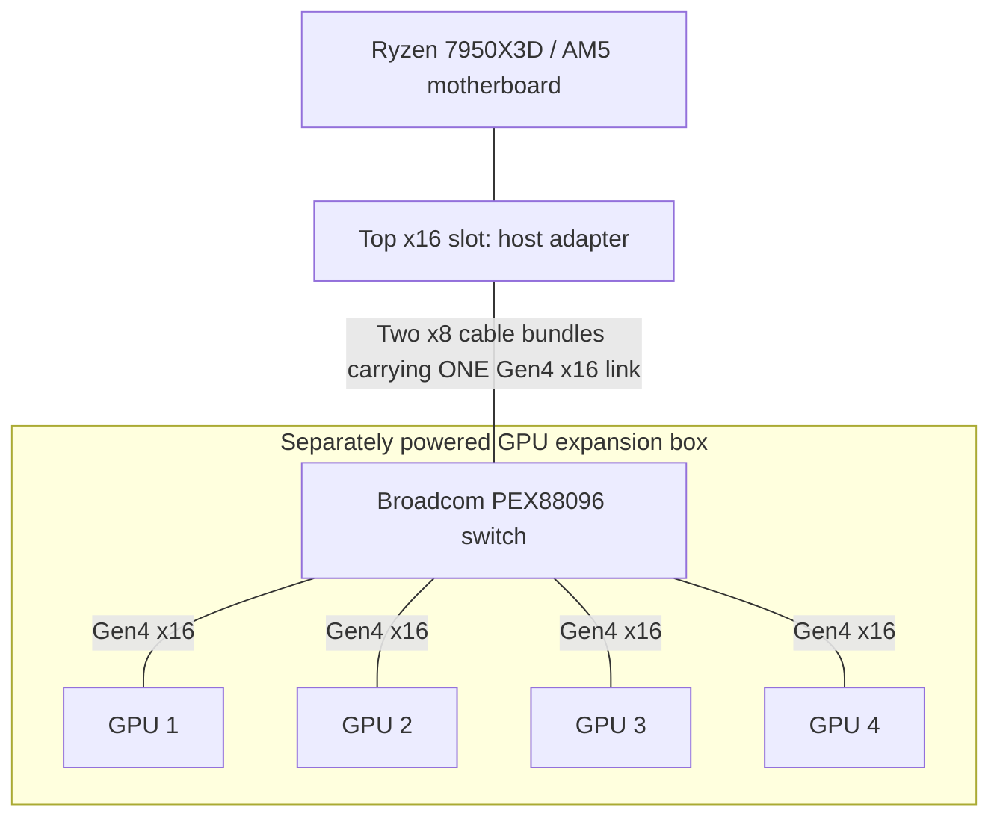

I have a dream. Of running four or more GPUs off of a regular consumer motherboard that technically cannot do that. At least, not with the connections I want. To make this happen, I had to research some pretty esoteric hardware. Come with me on a journey which brought me to the world of PCIe switches.

I currently own a pretty beefy consumer machine (bought at pre-insane prices) with an AM5 socket motherboard. The problem is that my Ryzen has 28 native PCIe lanes, four of which connect to the chipset. Of the remaining lanes, only 16 are routed to the motherboard's two graphics slots. That means I can connect a single GPU at PCIe 5.0 x16, or two GPUs at x8 each, which is what I'm doing now.

To connect four GPUs, I could split the lanes further and give less bandwidth to each GPU. Or I could install a PCIe switch. That would let the GPUs talk to each other over P2P at the speed of their connections to the switch, while sharing a smaller pipe back to the machine, like 16 lanes. For the inference setup I want, where the model stays in GPU memory, that should be fine. The host connection would be used mainly to load the model, send in the prompts, and read the responses. The repeated GPU-to-GPU transfers could stay on the switch instead of competing for that connection.

My plan is to put four RTX Pro 6000s in a separate box with a Broadcom PEX88096 backplane, its own power supply, and enough room to cool the cards. Two PCIe cables would connect it to the existing PC. This particular switch is Gen4, so that's the speed the cards would run at, even though they support Gen5, because Gen5 switches are up to 10x more expensive, for little gain in inference speed.

This reference photo is close to what I have in mind:

<!-- IMAGE 1: The reference screenshot supplied with this article request.
No public source URL supplied. Upload the screenshot to GitHub after cropping out the phone UI and black borders.
Caption: Reference photo, not my build. The host adapter outside the case would go in the main PC. The GPUs would go in the four slots inside the box.
-->

## Why I want to keep the AM5 board

Here is my current hardware:

```text
CPU: AMD Ryzen 9 7950X3D 16-Core
Motherboard: ROG CROSSHAIR X670E HERO
RAM: 192 GB DDR5 5200
GPU: Dual NVIDIA RTX Pro 6000 (96 GB VRAM each)
```

This is the machine from my [dual-GPU vLLM guide](). Four of those cards would give me 384 GB of total VRAM instead of 192 GB. The inference engine would still need to split the model across them; the backplane doesn't turn their memory into one transparent pool.

I don't particularly want to replace the CPU, motherboard, and RAM just to connect more GPUs. Prices have gone completely insane: a comparable Corsair 192 GB DDR5-5200 kit that was [$649.99 before the shortage](https://www.tomshardware.com/pc-components/ram/ram-scalping-takes-hold-on-ebay-some-kits-selling-for-more-than-usd2-000-price-gouged-kits-fetch-7x-their-original-value-adding-almost-double-the-markup-on-already-inflated-prices) is now [listed at $2,904.99](https://www.corsair.com/us/en/p/memory/cmk192gx5m4b5200c38/vengeance-192gb-4x48gb-ddr5-dram-5200mhz-c38-memory-kit-black-cmk192gx5m4b5200c38), more than four times as much for the same RAM.

The GPUs are worse in absolute dollars. In [October 2025, I quoted about $8,000 per RTX Pro 6000](); [Newegg's recorded September 15, 2026 price](https://www.nowinstock.net/computers/videocards/nvidia/rtxpro/full_history/) was $17,999.99 for the Workstation Edition. At that price, two GPUs and a comparable RAM kit alone come to almost $39,000, versus about $16,650 before. Using a rough $1,300 allowance for the [CPU](https://shop-us-en.amd.com/amd-ryzen-9-7950x3d-processor/) and [motherboard](https://e-catalog.com/ASUS-ROG-CROSSHAIR-X670E-HERO.htm) in both estimates, the main hardware goes from around $18,000 to around $40,000. That's a rough comparison using advertised prices, not what I personally paid or the cheapest possible shopping basket; it excludes the case, storage, cooling, PSU, shipping, and tax. GPU offers vary wildly, and the same tracker has recorded much cheaper Newegg Business listings that have since gone out of stock.

A Threadripper or EPYC platform would give me more lanes, but I'd rather keep the machine I already own.

And yes, consumer machines can run four GPUs through narrower links and adapters. Mining rigs have been doing that for years. I'm after four x16 connections for inference, with the GPUs able to exchange data without going back through the motherboard.

## Bifurcation doesn't add lanes

A passive bifurcation adapter splits an existing link. If the motherboard supports x4/x4/x4/x4, it can divide an x16 slot between four devices. Each gets four lanes. An x16-shaped socket on the adapter doesn't change that.

A PCIe switch works differently. It has an upstream link to the host and separate downstream links to the devices. The PEX88096 has enough lanes for an x16 upstream connection and four x16 GPU connections, with lanes left over. When a GPU accesses system memory, the switch forwards that traffic upstream. When one GPU accesses another GPU's memory through a supported P2P path, the switch can route it locally.

That last part is why I'm interested. The GPUs don't have to send their peer traffic up the cable to the motherboard and back again.

Here is the topology I want. This is a logical diagram; the power wiring is separate.



For example, GPU 1 to GPU 2 traffic follows GPU 1 → switch → GPU 2. There is no separate cable connecting the GPUs to each other.

The host connection is still a bottleneck for traffic that needs the CPU or system RAM. PCIe 4.0 x16 carries about 31.5 GB/s in each direction before packet overhead. All four GPUs share that upstream bandwidth. Four x16 downstream ports do not give me four x16 connections to the CPU.

For models that fit entirely in VRAM, I'm interested in how much communication can stay between the GPUs. If I spend inference time moving weights back and forth from system RAM, the shared uplink matters much more.

## The PEX88096 backplane

This is the type of board I'm planning around:

<!-- IMAGE 2: Product overview of the four-slot PEX88096 backplane.
Original: https://level1techs.us-east-1.linodeobjects.com/original/4X/8/0/c/80c4d52d9595e394d39d7b197ed328e735addeba.webp
Caption: Product image shared in vitabis's Poor(er) man's local AI build thread.
Credit/source: https://forum.level1techs.com/t/poor-er-mans-local-ai/252071/3
-->

The PEX88096 is a PCIe Gen4 switch, often called a PLX switch in listings and forum posts. The usual description is a 96-lane switch. [Broadcom's specification](https://www.broadcom.com/products/pcie-switches-retimers/expressfabric/gen4/pex88096) lists 98 including two dedicated x1 management ports. The useful arithmetic for this build is 16 host lanes + 64 GPU lanes = 80 lanes.

The chip name alone doesn't tell me what a seller has wired up. Some boards have physical GPU slots. Others are add-in cards with a row of SlimSAS connectors and need separate powered slot adapters for every GPU. A listing advertising five x16 connections may expose one of them through cables rather than a fifth physical slot.

I prefer the backplane with four physical slots. If the spacing works, the GPUs can plug straight into it and I can avoid four extra risers.

<!-- IMAGE 3: Backplane mounted on standoffs in an open frame.
Original: https://level1techs.us-east-1.linodeobjects.com/original/4X/8/d/6/8d6d291e89b2c65df27036f5f9e220a8aab8117e.jpeg
Caption: Vitabis's backplane installed in a frame, before adding the GPUs.
Credit/source: https://forum.level1techs.com/t/poor-er-mans-local-ai/252071/3
-->

There is useful background from [OLDMONSTER, the author of the open-source PEX8796/PEX88096 designs](https://forums.servethehome.com/index.php?threads/about-chinese-pcie-switch.55718/). He describes a Chinese market for salvaged and refurbished switch chips, with a PEX88096 chip costing around $60 and an AIC version costing around $110 to make locally. Those are his reported costs, not a price I can order this backplane for, shipped to the US.

In [thr3e's early purchase report](https://forum.level1techs.com/t/171428/837), the board cost $538. The [ServeTheHome testing thread](https://forums.servethehome.com/index.php?threads/new-chinese-pcie-switch-board-gpu-testing.52488/) reports about 45–50 W for the powered board alone. I'll need airflow over the switch heatsink even before accounting for the GPUs.

I also want the port configuration confirmed before ordering. [Some variants have DIP switches](https://forum.level1techs.com/t/171428/902) for changing downstream lane splits; others need firmware changes. For my build, I want it shipped ready for one x16 host link and four x16 GPUs. I don't want finding Broadcom configuration software to be the first step.

## Connecting it to a regular PCIe slot

My X670E Hero doesn't have MCIO or SlimSAS ports. The host adapter supplies those connectors by plugging into the top PCIe slot.

<!-- IMAGE 4: Shinreal host adapter (left) and two powered GPU slot adapters (right).
Original: https://level1techs.us-east-1.linodeobjects.com/original/4X/c/f/b/cfbbf8962f247400326f55eea87293960743e983.jpeg
Caption: Vitabis's adapter photo. Left goes in the host; the two boards on the right each provide a remote GPU slot. Those aren't needed when the backplane already has the slots.
Credit/source: https://forum.level1techs.com/t/poor-er-mans-local-ai/252071/3
-->

The connection I'm considering is a PCIe x16-to-dual-MCIO x8 host adapter and two MCIO-to-SlimSAS cables to the backplane's upstream ports. If I choose a backplane with MCIO upstream ports instead, the cable ends change accordingly.

Two cables don't imply x8/x8 bifurcation. In this arrangement they carry the two halves of one x16 link to one switch. The adapter must support that wiring, including the required clock and reset signals. I need a matched adapter/cable/backplane combination, not just connectors that fit.

Vitabis used a passive Shinreal host adapter and describes 1 m Shinreal and 0.8 m 10Gtek MCIO-to-SlimSAS cables. That's a starting point for shopping, not a guarantee for my motherboard. I'll keep the run short and leave room for the bends and connector strain relief.

I'll also leave the second CPU-connected slot empty so the host adapter can get all 16 lanes, using the Ryzen's integrated graphics for display output.

A redriver or retimer may be needed if the signal path is too lossy. They aren't switches and don't add device ports. I don't plan to add one automatically: in [the initial switch-board test](https://forums.servethehome.com/index.php?threads/new-chinese-pcie-switch-board-gpu-testing.52488/post-485898), a retimer interfered with automatic power-on timing, and changing to a passive adapter helped. In a [different Gen5 build](https://forum.level1techs.com/t/171428/924), a retimer was needed to stop GPUs dropping out. Those are different systems with different signal paths.

## P2P is the part I need to test

With tensor-parallel inference, GPUs repeatedly exchange intermediate results. If peer access isn't available, transfers may need staging through host memory. That adds traffic to the shared uplink and usually costs latency.

With working PCIe P2P, the GPUs can access each other's memory directly. The switch gives them a local route, but it cannot override a GPU driver's restrictions.

The GeForce builds in these threads use community-modified NVIDIA drivers, including the [aikitoria fork of the open GPU kernel modules](https://github.com/aikitoria/open-gpu-kernel-modules). Those results aren't evidence that stock 3090 or 5090 drivers will enable PCIe P2P. My intended cards are RTX Pro 6000s, so I plan to test their supported driver path first rather than assume I need a GeForce patch.

One useful result is [TrashMaster's three-RTX-3090 test](https://forums.servethehome.com/index.php?threads/new-chinese-pcie-switch-board-gpu-testing.52488/post-491789):

| GPU-to-GPU test | P2P disabled | P2P enabled |
|---|---:|---:|
| One-way bandwidth | About 11.5 GB/s | About 26.4 GB/s |
| Bidirectional bandwidth | About 17 GB/s | About 52.2 GB/s |
| GPU-measured latency | About 13–14 µs | About 1 µs |

These are pairwise results from his CUDA sample output, not my measurements or a four-GPU simultaneous bandwidth test. The 52.2 GB/s figure adds both directions; it doesn't exceed the Gen4 x16 limit in either direction.

The AM5 example closest to my plan is [vitabis's build](https://forum.level1techs.com/t/poor-er-mans-local-ai/252071/3): a Ryzen 9600X, Gigabyte X670E Aorus Master, and four 3090s on the switch backplane.

<!-- IMAGE 5: Vitabis's assembled GPU frame above the AM5 host.
Original: https://level1techs.us-east-1.linodeobjects.com/original/4X/5/7/4/574f7f7e484c3ef4e5b9be230403bc9155b223b1.jpeg
Caption: Vitabis's assembled build. His motherboard is an X670E Aorus Master, not my ASUS X670E Hero.
Credit/source: https://forum.level1techs.com/t/poor-er-mans-local-ai/252071/3
-->

He couldn't get P2P working on the B550 and X570 setups he tried, then succeeded on AM5. That's encouraging for my plan, but doesn't establish that every AM5 board works or every AM4 board fails.

Also, a switch isn't the only way to get P2P. [Panchovix reports working peer access between two 5090s on bifurcated AM5 CPU lanes](https://forums.servethehome.com/index.php?threads/new-chinese-pcie-switch-board-gpu-testing.52488/post-492670). Traffic crossing a CPU root complex is not necessarily being copied through system RAM. My reason for using the switch is to get more wide GPU links and keep their peer traffic off the shared host link.

## Why Gen4 when the cards support Gen5?

The PEX88096 will limit these Gen5-capable GPUs to Gen4. I want to know what I'm giving up before committing to it.

The [PEX89048](https://www.broadcom.com/products/pcie-switches-retimers/expressfabric/gen5/pex89048) is a 48-lane Gen5 switch. With 16 lanes used upstream, there are 32 left: enough for two x16 GPU links, or four x8 links if the board supports that configuration. Gen5 x8 has about the same link bandwidth as Gen4 x16. It isn't a four-x16 replacement for the PEX88096.

The [PEX89104](https://www.broadcom.com/products/pcie-switches-retimers/expressfabric/gen5/pex89104) has 104 Gen5 lanes and enough capacity for my proposed topology. There are larger boards too: [ServeTheHome post #81](https://forums.servethehome.com/index.php?threads/new-chinese-pcie-switch-board-gpu-testing.52488/post-501529) shows a UTran PEX89144 board with eight downstream x16 slots and a dual-MCIO upstream connection. That post describes the hardware received, not a completed eight-GPU performance test.

The complication is getting a good board at a price that makes sense. OLDMONSTER says his NUC13/PEX89104 prototype functioned but didn't meet Gen5 signal requirements, and he wasn't planning mass production. That's a report about his design, not evidence that Gen5 expansion can't work.

There is also a shopping correction worth making: [this AliExpress listing](https://www.aliexpress.us/item/3256811978810464.html) shows an add-in card, not the four-slot backplane above. Its product photo has an `89048` marking on the PCB. I need the seller's actual specifications before treating it as a candidate, much less ordering it as a PEX88096 backplane.

<!-- IMAGE 6: AliExpress switch add-in card with silver heatsink and blower; distinct from the four-slot backplane.
Original: https://ae-pic-a1.aliexpress-media.com/kf/S49d64d7f97624f1cb1fd9d0778081b54e.jpg
Caption: Product photo from the linked AliExpress listing. The PCB marking is a clue, not verification of the chip under the heatsink.
Credit/source: https://www.aliexpress.us/item/3256811978810464.html
-->

## Fitting and cooling four cards

An electrical x16 connection doesn't help if the cooler blocks the next slot. Before choosing a case, I need to check the actual backplane dimensions, mounting holes, GPU thickness, and power-connector clearance.

This photo from vitabis's build is a good reason to do that first:

<!-- IMAGE 7: Close-up of GPU bracket misalignment with the frame.
Original: https://level1techs.us-east-1.linodeobjects.com/original/4X/f/2/c/f2c660eef4d843b92810c59c5af8b2307ee0f84a.jpeg
Caption: The frame's bracket cutouts didn't line up with the installed backplane.
Credit/source: vitabis, https://forum.level1techs.com/t/poor-er-mans-local-ai/252071/3
-->

If direct mounting puts the cards too close together, short risers would let me space them out. I'm looking at the [LINKUP AVA5 range](https://linkup.one/pcie-5.0-riser-cable-RTX5090), including the [straight 30 cm version](https://www.amazon.com/dp/B0D5F72XTL). Length and connector orientation need to match the layout. A Gen5-rated riser still runs at Gen4 behind this switch.

<!-- IMAGE 8: Server-style PCIe risers positioned on the frame.
Original: https://level1techs.us-east-1.linodeobjects.com/original/4X/b/f/3/bf3587cc4049923e2225be86174a76a5c6aa18d9.jpeg
Caption: The server-style risers in vitabis's build, not the LINKUP product. Notice the connector orientation.
Credit/source: https://forum.level1techs.com/t/poor-er-mans-local-ai/252071/3
-->

I've also saved [this Alibaba 5U chassis](https://www.alibaba.com/product-detail/5U-8-drive-Hot-swappable-Redundant_1601402232257.html). It is a case candidate, not a confirmed fit for the backplane. The listing's hot-swappable drive bays don't mean the GPUs or their PCIe cables are hot-pluggable.

For wiring inspiration, [Nathan Odle's four-RTX-Pro-6000 build](https://x.com/mov_axbx/status/1999689233171394955) uses a motherboard with native MCIO. He says it made the build much cleaner than his previous seven-4090 setup. I'll need the host adapter to get similar cabling from my consumer board.

<!-- IMAGE 9: Nathan Odle's rack with the four-RTX-Pro-6000 system on the upper shelf.
Original: https://pbs.twimg.com/media/G8BSwdFXkAAPnDP?format=jpg&name=large
Caption: Photo: Nathan Odle. A cabling reference, not an AM5/PEX88096 compatibility test.
Credit/source: https://x.com/mov_axbx/status/1999689233171394955
-->

Power limits will determine a lot of the enclosure design. Four cards configured for 600 W each would be 2,400 W for the GPUs alone. At 300 W each, that's still 1,200 W before the switch and fans. I need to size the PSU, power distribution, connectors, and wall circuit for the intended sustained load, with headroom for transients and conversion losses.

The backplane supplies slot power; the GPUs also need their auxiliary power connections. I'll need the documented pinouts and power-on sequence for the exact board. If I use multiple PSUs, their outputs can't simply be tied together. A redundant PSU arrangement also needs enough capacity after losing a module if I expect it to remain redundant under load.

I already had to [change the fan control on my dual-GPU workstation](). Four cards in another box won't make that problem disappear.

<!-- IMAGE 10: Veratu's Max Blackwell build, showing GPU spacing, fans and ducting. Preserve the watermark.
Original: https://veratu.com/builds/maxblackwell/OpenSideAngleDuct1080_WM-fs8.png
Caption: Photo: Veratu, Max Blackwell. The builder describes controlling GPU power and using the flow-through coolers as a heat chimney in a space-constrained case.
Credit/source: https://veratu.com/builds/maxblackwell/index.html
-->

## What I'll check before calling it working

First I want the seller to confirm the board revision, upstream ports, four downstream x16 links, power requirements, and included cables. Then I'll test with an inexpensive PCIe device before connecting an RTX Pro 6000, followed by one GPU, two, and finally four. All cabling changes will happen with both systems powered off.

On the host, I'll need Above 4G Decoding and enough MMIO address space for the GPUs. Resizable BAR is a separate setting; exposing large BARs can increase the address-space requirement. If enumeration fails, I need to investigate the BIOS allocation rather than assume the cables are bad.

The first checks are:

```console
lspci -tv
sudo lspci -vv
nvidia-smi -L
nvidia-smi topo -m
nvidia-smi topo -p2p p
sudo journalctl -k -b | grep -Ei 'AER|PCIe Bus Error|NVRM|Xid'
```

I'll inspect `LnkSta` for the upstream link and each GPU link under load. The target is `Speed 16GT/s, Width x16` for Gen4 x16. A GPU appearing in `nvidia-smi` doesn't establish that it negotiated the expected width or speed.

`PIX` and `PXB` in the topology output describe paths through PCIe bridges without crossing the host bridge. They don't prove CUDA peer access works. I'll check peer capability, run the CUDA `simpleP2P` correctness test, and test every GPU pair. For bandwidth, [NVIDIA now recommends `nvbandwidth`](https://docs.nvidia.com/deeplearning/nccl/user-guide/docs/troubleshooting/gpu_troubleshooting.html); `p2pBandwidthLatencyTest` is also useful for comparing against the forum results.

NVIDIA's troubleshooting documentation calls out ACS redirection and IOMMU translation as possible problems for PCIe P2P. I'll check the active configuration rather than copy a collection of GRUB flags. Changing those settings affects device isolation, so a bare-metal inference machine and a GPU-passthrough VM need different treatment.

I'll also make sure AER reporting is actually active. An empty error log is less reassuring if errors aren't being reported. In [vitabis's follow-up](https://forum.level1techs.com/t/171428/1019), disabling ASPM stopped a specific pattern of PCIe errors. That's something to investigate if I see the same symptoms, not a default fix for every build.

Finally, I'll run a model that fits on both two and four GPUs with the same inference settings and compare prefill, decode, and concurrent requests. NCCL logs and collective tests should tell me whether the application is using peer transport; GPU utilization alone won't. Then I'll try the larger models that justify the extra VRAM.

For now, the purchase I want to validate is the backplane, host adapter, and two cables. I'll settle the case and power system around the exact board and card spacing. The first result I want to publish is four GPUs detected at the expected link widths, with verified peer access and a sustained inference run on this ASUS AM5 board.
