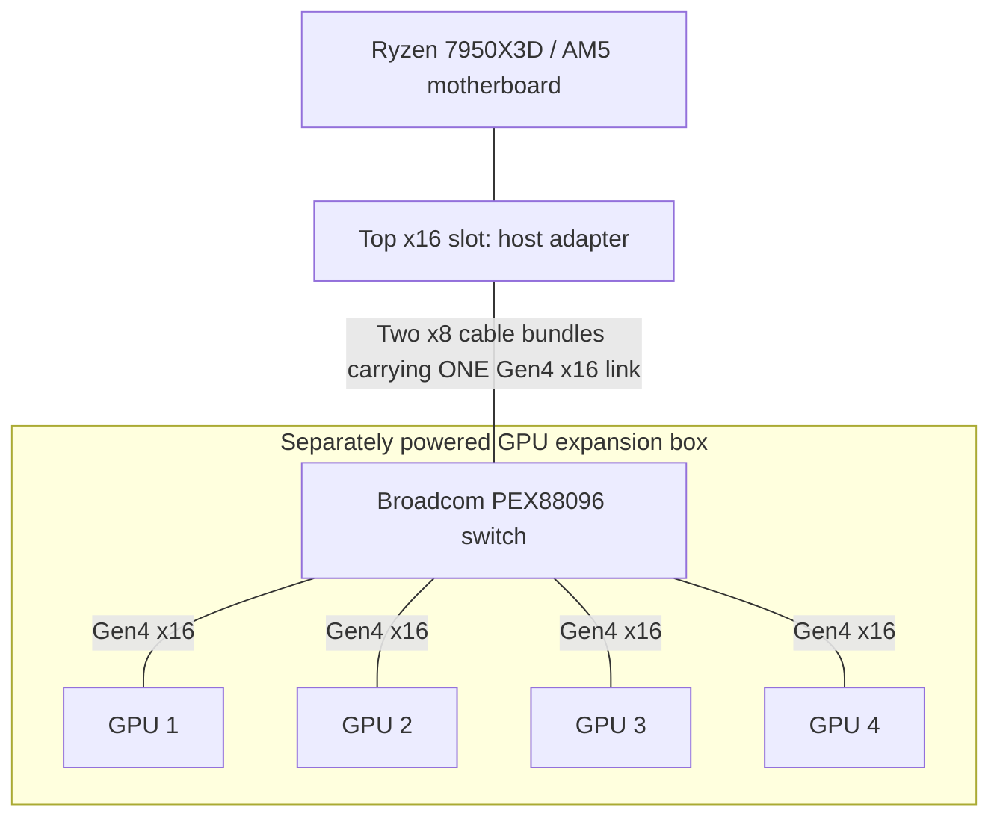

I have a dream. Of running four or more GPUs off of a regular consumer motherboard that technically cannot do that. At least, not with the connections I want. To make this happen, I had to research some pretty esoteric hardware. Come with me on a journey which brought me to the world of PCIe switches.

I currently own a pretty beefy consumer machine (bought at pre-insane prices) with an AM5 socket motherboard. The problem is that my Ryzen has 28 native PCIe lanes, four of which connect to the chipset. Of the remaining lanes, only 16 are routed to the motherboard's two graphics slots. That means I can connect a single GPU at PCIe 5.0 x16, or two GPUs at x8 each, which is what I'm doing now.

To connect four GPUs, I could split the lanes further and give less bandwidth to each GPU. Or I could install a PCIe switch. That would let the GPUs talk to each other over P2P at the speed of their connections to the switch, while sharing a smaller pipe back to the machine, like 16 lanes. For the inference setup I want, where the model stays in GPU memory, that should be fine. The host connection would be used mainly to load the model, send in the prompts, and read the responses. The repeated GPU-to-GPU transfers could stay on the switch instead of competing for that connection.

My plan is to put four RTX Pro 6000s in a separate box with a Broadcom PEX88096 backplane, its own power supply, and enough room to cool the cards. Two PCIe cables would connect it to the existing PC. This particular switch is Gen4, so that's the speed the cards would run at, even though they support Gen5, because Gen5 switches are up to 10x more expensive, for little gain in inference speed.

This reference photo is close to what I have in mind:


## Why I want to keep the AM5 board

Here is my current hardware:

```text
CPU: AMD Ryzen 9 7950X3D 16-Core
Motherboard: ROG CROSSHAIR X670E HERO
RAM: 192 GB DDR5 5200
GPU: Dual NVIDIA RTX Pro 6000 (96 GB VRAM each)
```

This is the machine from my [dual-GPU vLLM guide](https://www.ovidiudan.com/2025/12/25/dual-rtx-pro-6000-llm-guide.html). I don't particularly want to replace the CPU, motherboard, and RAM just to connect more GPUs. Prices have gone completely insane: for example a comparable Corsair 192 GB DDR5-5200 kit that was [$649.99 before the shortage](https://www.tomshardware.com/pc-components/ram/ram-scalping-takes-hold-on-ebay-some-kits-selling-for-more-than-usd2-000-price-gouged-kits-fetch-7x-their-original-value-adding-almost-double-the-markup-on-already-inflated-prices) is now [listed at $2,904.99](https://www.corsair.com/us/en/p/memory/cmk192gx5m4b5200c38/vengeance-192gb-4x48gb-ddr5-dram-5200mhz-c38-memory-kit-black-cmk192gx5m4b5200c38), more than four times as much for the same RAM.

And yes, consumer machines can run four GPUs through narrower links and adapters. Mining rigs have been doing that for years. I'm after four x16 connections for inference, with the GPUs able to exchange data without going back through the motherboard.

## Bifurcation doesn't add lanes

A passive bifurcation adapter splits an existing link. If the motherboard supports x4/x4/x4/x4, it can divide an x16 slot between four devices. Each gets four lanes. An x16-shaped socket on the adapter doesn't change that.

A PCIe switch works differently. It has an upstream link to the host and separate downstream links to the devices. The PEX88096 has enough lanes for an x16 upstream connection and four x16 GPU connections, with lanes left over. When a GPU accesses system memory, the switch forwards that traffic upstream. When one GPU accesses another GPU's memory through a supported P2P path, the switch can route it locally.

That last part is why I'm interested. The GPUs don't have to send their peer traffic up the cable to the motherboard and back again.

Here is the topology I want:



For example, GPU 1 to GPU 2 traffic follows GPU 1 → switch → GPU 2. There is no separate cable connecting the GPUs to each other.

The host connection is still a bottleneck for traffic that needs the CPU or system RAM. PCIe 4.0 x16 carries about 31.5 GB/s in each direction before packet overhead. All four GPUs share that upstream bandwidth.

For models that fit entirely in VRAM, I'm interested in how much communication can stay between the GPUs. If I spend inference time moving weights back and forth from system RAM, the shared uplink matters much more.

## The PEX88096 backplane

This is the type of board I'm planning around:


The PEX88096 is a PCIe Gen4 switch, often called a PLX switch in listings and forum posts. The usual description is a 96-lane switch. [Broadcom's specification](https://www.broadcom.com/products/pcie-switches-retimers/expressfabric/gen4/pex88096) lists 98 including two dedicated x1 management ports. The useful arithmetic for this build is 16 host lanes + 64 GPU lanes = 80 lanes.

There is useful background from [OLDMONSTER, the author of the open-source PEX8796/PEX88096 designs](https://forums.servethehome.com/index.php?threads/about-chinese-pcie-switch.55718/). He describes a Chinese market for salvaged and refurbished switch chips, with a PEX88096 chip costing around $60 and an AIC version costing around $110 to make locally. Those are his reported costs, not a price I can order this backplane for, shipped to the US. The cost to order and ship it from China is closer to $600.

## Connecting it to a regular PCIe slot

My X670E Hero doesn't have MCIO or SlimSAS ports. The host adapter supplies those connectors by plugging into the top PCIe slot:


Two cables don't imply x8/x8 bifurcation. In this arrangement they carry the two halves of one x16 link to one switch. The adapter must support that wiring, including the required clock and reset signals. I need a matched adapter/cable/backplane combination, not just connectors that fit.

I'll also leave the second CPU-connected slot empty so the host adapter can get all 16 lanes, using the Ryzen's integrated graphics for display output.

A redriver or retimer may be needed if the signal path is too lossy. They aren't switches and don't add device ports. I don't plan to add one automatically: in [the initial switch-board test](https://forums.servethehome.com/index.php?threads/new-chinese-pcie-switch-board-gpu-testing.52488/post-485898), a retimer interfered with automatic power-on timing, and changing to a passive adapter helped. In a [different Gen5 build](https://forum.level1techs.com/t/171428/924), a retimer was needed to stop GPUs dropping out. Those are different systems with different signal paths.

## P2P is the part I need to test

With tensor-parallel inference, GPUs repeatedly exchange intermediate results. If peer access isn't available, transfers may need staging through host memory. That adds traffic to the shared uplink and usually costs latency.

With working PCIe P2P, the GPUs can access each other's memory directly. The switch gives them a local route, but it cannot override a GPU driver's restrictions.

The GeForce builds in these threads use community-modified NVIDIA drivers, including the [aikitoria fork of the open GPU kernel modules](https://github.com/aikitoria/open-gpu-kernel-modules). Those results aren't evidence that stock 3090 or 5090 drivers will enable PCIe P2P. My intended cards are RTX Pro 6000s, so I plan to test their supported driver path first rather than assume I need a GeForce patch.

One useful result is [TrashMaster's three-RTX-3090 test](https://forums.servethehome.com/index.php?threads/new-chinese-pcie-switch-board-gpu-testing.52488/post-491789):

| GPU-to-GPU test | P2P disabled | P2P enabled |
|---|---:|---:|
| One-way bandwidth | About 11.5 GB/s | About 26.4 GB/s |
| Bidirectional bandwidth | About 17 GB/s | About 52.2 GB/s |
| GPU-measured latency | About 13–14 µs | About 1 µs |

These are pairwise results from his CUDA sample output, not my measurements or a four-GPU simultaneous bandwidth test. The 52.2 GB/s figure adds both directions; it doesn't exceed the Gen4 x16 limit in either direction.

The AM5 example closest to my plan is [vitabis's build](https://forum.level1techs.com/t/poor-er-mans-local-ai/252071/3): a Ryzen 9600X, Gigabyte X670E Aorus Master, and four 3090s on the switch backplane.


[HERE EXPLAIN THAT RTX PRO 6000 Blackwell GPUs have P2p by default in their drivers, as they are Workstation class graphics cards?!?!]

## Why Gen4 when the cards support Gen5?

The PEX88096 will limit these Gen5-capable GPUs to Gen4. The [PEX89048](https://www.broadcom.com/products/pcie-switches-retimers/expressfabric/gen5/pex89048) is a 48-lane Gen5 switch. With 16 lanes used upstream, there are 32 left: enough for two x16 GPU links, or four x8 links if the board supports that configuration. Gen5 x8 has about the same link bandwidth as Gen4 x16. It isn't a four-x16 replacement for the PEX88096.

The [PEX89104](https://www.broadcom.com/products/pcie-switches-retimers/expressfabric/gen5/pex89104) has 104 Gen5 lanes and enough capacity for my proposed topology. There are larger boards too: [ServeTheHome post #81](https://forums.servethehome.com/index.php?threads/new-chinese-pcie-switch-board-gpu-testing.52488/post-501529) shows a UTran PEX89144 board with eight downstream x16 slots and a dual-MCIO upstream connection. That post describes the hardware received, not a completed eight-GPU performance test.


The complication is getting a good board at a price that makes sense. [HERE explain that Gen5 cards like c-payne are 2500 euro + tax + customs, and shipping, and other backplanes can easily go to $5K and above. So buying a much cheaper Gen4 instead that is 10X cheaper is a no-brainer.]

Here's the c-payne image: 

[Explain that I ordered the kit plus the case made specially for it from my original image -- feel free to look at the image Astra -- and the total cost was $577.5 for the expansion cards and cables, $250 for the case without PSU and fans, plus tax, plus import taxes, plus shipping = $976.2. Now we wait. Will write another post when it arrives and I can test it.]
